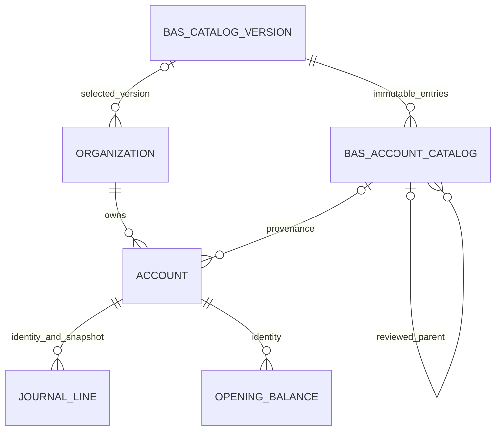

# Versionerad BAS-katalog

## Modell och migration

Migration `20261009010000_bas_catalog` är framåtriktad; totalt 25 migrationer.
`BasCatalogVersion` håller UUID, unik version, sourceVersion/referens/hash,
hash för granskat importmanifest, licens-/klassificeringsreferenser,
verifieringsrapport, exakt radantal, explicit global standardflagga och timestamps.
`BasAccountCatalog` håller UUID, versions-FK, nummer, fullständigt officiellt namn,
klass/grupp och rubriknamn, kategori, granskad parent, K2-markering, bookable/default,
ekonomisk typ/normalbalans och gransknings-/källposition.

Alla nya FK använder RESTRICT, inte historikraderande CASCADE. Parentens komposit-FK
kräver samma version. `(catalogVersionId, accountNumber)` och befintliga
`(organizationId, accountNumber)` är unika. Partiellt index tillåter en global
standardversion. Versions-/klass-/grupp-/kategori-/default-/proveniensindex och
pg_trgm på officiella namn stödjer avgränsade queries. Befintlig svensk ICU-collation
används för namn; numerisk sortering görs numeriskt. PostgreSQL behöver pg_trgm/ICU.

Katalogposter kan inte ändras/raderas/trunkeras. En versions källidentitet/radantal
kan inte ändras; endast standardvalet kan ändras separat. Deferrable kontroll kräver
exakt deklarerat antal poster i samma importtransaktion och hindrar senare tillägg.
`Account.name` utökas från varchar(160) till TEXT; DTO/UI tillåter 2000 tecken utan
tyst trunkering. Ekonomiska belopp, snapshots och äldre migrationer ändras inte.

## Oberoende metadata

GROUP_ACCOUNT/MAIN_ACCOUNT/SUBACCOUNT beskriver struktur, inte ASSET/LIABILITY/
EQUITY/REVENUE/EXPENSE. Struktur kan härledas från verifierade fyrsiffriga nummer;
ekonomisk typ, DEBIT/CREDIT och bokföringsbarhet kräver explicit granskning per post.
Klass 2/8 och kontra-/avskrivningskonton får inte typas enbart från första siffran.
`#` är boolean-metadata, aldrig en del av numret. Inga godtyckliga momskoder sätts.

## Auktoriserad import

Bygg DB och API först. Kör aldrig importen från startup, seed eller migrationshook.
Använd migrator-/operatörscredentials, inte vanlig runtime-login. Det normaliserade
manifestets kontrakt definieras i `apps/api/src/accounts/bas/catalog-validation.ts`:

- version, sourceVersion/reference/SHA-256, licens- och klassificeringsreferens;
- expectedAccounts = exakt antal unika, granskade konton;
- rightsConfirmed och allSourceEntriesReviewed måste vara true;
- unresolvedClassifications, unresolvedNames, unresolvedDuplicates måste vara 0;
- varje post har exakt namn, nummer, kategori, granskad parent, type/normalBalance,
  isBookable, isK2Restricted, classificationReference och sourcePosition.

Detta är ett internt, granskat manifestformat, inte ett påstått stöd för BAS API:s
råa JSON-format. Källavvikelser måste lösas före normalisering. Max 12 MiB och
10000 poster, inga saknade fält/dubbletter/påhittade parents eller generella typer.

Sätt operatörens skyddade `DATABASE_URL`, `BAS_CATALOG_IMPORT_ENABLED=true`,
`BAS_CATALOG_INPUT_FILE` och `BAS_CATALOG_APPROVED_SHA256` (oberoende granskad hash).
Kör `corepack pnpm@9.15.4 bas:import --authorize` och använd `--make-default` enbart
efter ett explicit beslut om nyföretagens standardversion. Secrets ska inte skrivas
i shellhistorik/Git eller på frontend. Runtime får SELECT men inte katalogmutation.
Reapplicera granskade grants i `ops/database-runtime-role.sql` efter migrationen.

Importeraren använder transaction advisory lock och en DB-transaktion. Samma
version/hash är idempotent; samma version med annan hash nekas. Valet av global
standard uppgraderar inte redan versionsbundna företag och aktiverar inga valfria konton.

## Framtida versioner

Importera en ny, oberoende granskad version; uppdatera inte gamla källposter.
`corepack pnpm@9.15.4 bas:diff <före.json> <efter.json>` visar PREVIEW_ONLY för
tillagda/borttagna/ändrade fält och flaggar ekonomiskt känsliga ändringar.
Det rena jämförelseverktyget muterar ingenting. Företagsbyte till annan version
nekas i vanlig provisioning och kräver separat granskat avstämningsförfarande;
automatiskt massbyte av historiska konton är avsiktligt inte implementerat.
