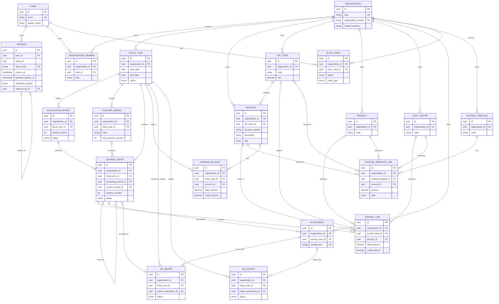

# LedgerApp database model

The Prisma schema is the source of truth for the PostgreSQL domain model:
[packages/db/prisma/schema.prisma](../packages/db/prisma/schema.prisma).
The initial accounting-domain migration also adds PostgreSQL constraints and
triggers that Prisma cannot express.

## ER model

## Tenant isolation

User and Session are global identity records. Every operational or accounting
record has a required organization_id.

Tenant isolation is enforced beyond application convention: tenant-owned
parents expose a redundant unique key such as (id, organization_id), and
children use composite foreign keys containing their own organization_id. For
example, a journal_line references both (journal_entry_id, organization_id) and
(account_id, organization_id). PostgreSQL therefore rejects a line that tries
to pair an entry in one organization with an account in another. Fiscal year,
accounting period, voucher series, dimensions, attachments, SIE jobs and
templates follow the same pattern.

Every application query must still scope by organization. Foreign keys protect
data integrity; they are not a substitute for authorization checks.

## Identity and session integrity

Sessions are global, disposable credentials. A persisted refresh session has a
family ID, a rolling expiry, an absolute expiry, revocation metadata, and an
optional self-reference to the session that replaced it. The phase 3 migration
backfills any pre-existing session as its own family and preserves its existing
expiry as the absolute limit before making those fields required.

`users.email` retains Prisma's conventional unique constraint and adds a
PostgreSQL unique expression index on `LOWER(email)`. Authentication normalizes
email before lookup and creation; the database index remains the final
case-insensitive concurrency backstop.

## Accounting invariants

- IDs are UUIDs. Mutable records carry created_at and updated_at; audit_events
  is append-only and only has created_at.
- Financial amounts are PostgreSQL DECIMAL(18,2). Quantities use
  DECIMAL(18,4), and VAT rates use DECIMAL(5,2); floats are not used.
- A voucher identity is unique across organization_id, fiscal_year_id,
  voucher_series_id and voucher_number. Drafts cannot take a voucher number.
  Posted and reversed entries require a series, positive number and posting
  timestamp. The posting transaction allocates the number with one atomic
  `UPDATE … RETURNING` on the fiscal-year-scoped voucher-series row; the unique
  constraint remains the final concurrency backstop.
- Journal lines and opening balances must have exactly one positive debit or
  credit amount. A deferred PostgreSQL constraint trigger requires posted and
  reversed entries to contain at least two lines and balance exactly at
  transaction commit.
- Fiscal year date ranges are valid and cannot overlap within an organization.
  Accounting periods have a valid date range and a period number from 1 to 13.
- A journal-entry trigger confirms that its date sits inside both its fiscal
  year and accounting period. Posting additionally requires that both are
  open; a locked period cannot be bypassed through a direct SQL client.
- Drafts may be edited, but PostgreSQL blocks updates or deletes of posted and
  reversed journal entries and their lines. `AuditEvent` records every create,
  draft update and post, and is itself immutable.
- AuditEvent is intentionally polymorphic through entity_type and entity_id,
  so it cannot have one conventional entity foreign key. A database trigger
  blocks updates and deletes of audit history.

## Delete and retention policy

All foreign keys declare an explicit action.

| Relationship                                                                        | Action   | Reason                                                          |
| ----------------------------------------------------------------------------------- | -------- | --------------------------------------------------------------- |
| Session to User                                                                     | CASCADE  | Sessions are disposable credentials.                            |
| Replaced session to successor session                                               | SET NULL | A successor is retained if a disposable predecessor is removed. |
| PostingTemplateLine to PostingTemplate                                              | CASCADE  | Template lines are mutable configuration, not ledger history.   |
| Accounting records, fiscal years, accounts, dimensions, attachments and SIE records | RESTRICT | Prevents accidental loss of bookkeeping history.                |
| Optional actor/uploader references to User                                          | SET NULL | Preserves the historical record if an identity is removed.      |

Organizations, accounts, VAT codes, projects, cost centers and voucher series
are designed to be deactivated rather than casually deleted.

## Chart of accounts scope

Accounts are organization-owned rather than tied to a single fiscal year. That
lets the same account identity remain valid across accounting years while
journal lines and opening balances carry their own fiscal-year references. If
LedgerApp later needs year-specific activation, it will use an explicit
tenant-safe `AccountFiscalYear` join model rather than a single `fiscal_year_id`
column on `accounts`.

Account-number searches use the tenant-scoped unique index. Account-name
substring search is supported by PostgreSQL `pg_trgm` in the account-management
migration. Journal lines, posting-template lines and opening balances all use
`RESTRICT` foreign keys to accounts; accounts are deactivated instead of
deleted.

## Development data

Run corepack pnpm db:seed after applying migrations. The idempotent development
seed creates one demo user and organization, the current Stockholm calendar
fiscal year with monthly periods, series A, two 25% VAT codes and a small BAS
account sample. It refuses to run when NODE_ENV=production.
